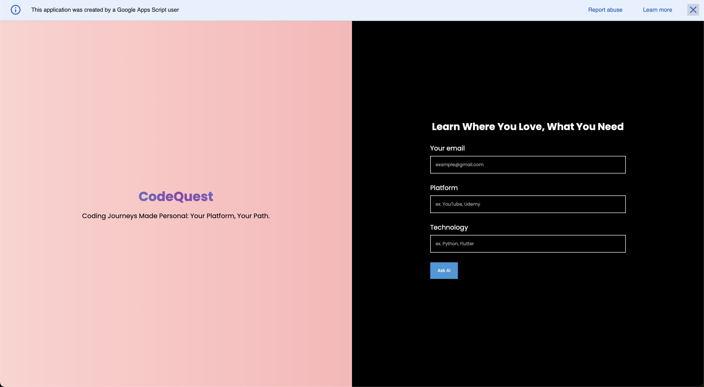

# CodeQuest

[CodeQuest](https://script.google.com/macros/s/AKfycbwkuiVDozkzbnDxgo-J9W4ISiw04SqjouRpUUPM-po5STGIiVLE6NU8TwLlZwiWE5WmNg/exec) is your ultimate destination for discovering curated learning resources across various platforms. Whether you're delving into Python, C++, Java, or any other technology, our platform, powered by PaLM, ensures you find quality courses on your preferred platforms like YouTube, Udemy, and Coursera. Empower your learning journey with a personalized map to the best online resources.

## Table of Contents
- [Key Features](#key-features)
- [How to Use](#how-to-use)
- [See It in Action](#see-it-in-action)
- [Credits](#credits)

## Key Features

- **PaLM Integration:** Help in matching best courses on popular learning platforms.
- **Platform Variety:** Search and discover resources on YouTube, Udemy, Coursera, and more.
- **User-Friendly:** Intuitive interface for easy navigation and quick access to curated content.
- Hosted and its live, use our platform - [CodeQuest](https://script.google.com/macros/s/AKfycbwkuiVDozkzbnDxgo-J9W4ISiw04SqjouRpUUPM-po5STGIiVLE6NU8TwLlZwiWE5WmNg/exec)

## How to Use

1. Enter the platform (e.g., YouTube, Udemy, Coursera).
2. Specify the technology you want to learn (e.g., Python, C++, Java).
3. Let PaLM work its magic, presenting you with a handpicked selection of top-notch resources.

## See It in Action

*First Page*

*After you hit submit*

*E-Mail you will get*

## Credits

Frontend Web Development by Anantesh - [View GitHub](https://github.com/AnanteshG)
